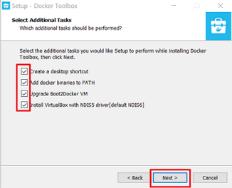
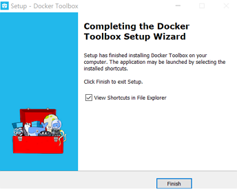

# Docker설치 및 DB연결 

## 목록
[1. Docker 이란?](#docker-%EB%9E%80) 
[2. 윈도우에서 Docker 설치하는 2가지 방법](#%EC%9C%88%EB%8F%84%EC%9A%B0%EC%97%90%EC%84%9C-docker-%EC%84%A4%EC%B9%98%ED%95%98%EB%8A%94-2%EA%B0%80%EC%A7%80-%EB%B0%A9%EB%B2%95)
[3. Docker 다운로드](#%EB%8B%A4%EC%9A%B4%EB%A1%9C%EB%93%9C) 
[4. Docker 기본 명령어](#docker-%EA%B8%B0%EB%B3%B8-%EB%AA%85%EB%A0%B9%EC%96%B4) 
[5. MySQL실행 방법](#mysql%EC%8B%A4%ED%96%89%EB%B0%A9%EB%B2%95) 
[6. DB 접속 확인](#db-%EC%A0%91%EC%86%8D-%ED%99%95%EC%9D%B8) 
[7. 가상화 에러 발생 대처방안](#%EA%B0%80%EC%83%81%ED%99%94-%EC%97%90%EB%9F%AC-%EB%B0%9C%EC%83%9D%EA%B3%BC-%ED%95%B4%EA%B2%B0%EB%B0%A9%EB%B2%95) 

## Docker 란?
**컨테이너 기반의 오픈소스 가상화 플랫폼** 입니다.
Docker는 하드웨어가 아니라 운영 시스템 (OS)을 가상화합니다. Docker는 가상 머신과는 달리 이미지 생성과 배포에 특화된 기능을 제공합니다.
Git에서 소스를 관리하는 것처럼 이미지 버전 관리 기능을 제공합니다. 그리고 중앙 관리를 위해 저장소에 이미지를 올리고, 받을 수 있습니다(Push/Pull). 게다가 GitHub처럼 Docker 이미지를 공유할 수 있는 Docker Hub도 제공합니다(GitHub처럼 개인 저장소도 제공합니다). 
 
(이미지 출처 : https://www.docker.com/what-container)

#### 이미지란?
필요한 실행파일과 라이브러리가 조합된 것을 말합니다.
이 이미지를 저장소에 올리고, 받을 수 있습니다.
하나의 이미지로 여러개의 컨테이너를 만들 수 있습니다.

#### 컨테이너란?
일종의 소프트웨어를 소프트웨어의 실행에 필요한 모든 것을 포함하는 완전한 파일 시스템 안에 감싸고 있는것 입니다. 
Linux 및 Windows 기반 응용 프로그램 모두에서 사용할 수있는 컨테이너 화 소프트웨어는 환경에 관계없이 항상 동일하게 실행됩니다. 컨테이너는 개발 환경과 준비 환경의 차이점과 같은 주변 환경으로부터 소프트웨어를 격리하고 동일한 인프라에서 다른 소프트웨어를 실행하는 팀 간의 충돌을 줄이는 데 도움이됩니다.
이미지를 실행한 것을 말합니다. (docker run 명령어를 사용)	
설치된 운영체제를 부팅하는 것과 비슷하다고 생각하면 됩니다.

## 윈도우에서 Docker 설치하는 2가지 방법 
#### 1. Docker for Windows  
- 설치 요구 사항 : Windows 10 Pro 이상, Build Number 10586 이상 
- 경로 : https://docs.docker.com/ 
 

#### 2. Docker Tool Box     
- Docker for Windows의 설치 요구 사항을 충족하지 못하는 경우
- 경로 : https://docs.docker.com/toolbox/ 
  

#### 두 가지 방법으로 나뉘는 이유

Window에서 Docker를 사용하기 위해서는 우선적으로 가상화된 서버 컴퓨터 환경을 만들어 줘야 합니다. Docker for Windows (1번 방법)에서는 Hyper-V라는 하이퍼바이저 기반의 가상화 시스템을 사용하고 있습니다. 그러나 Hyper-v는 윈도우 8프로 윈도우 10프로 이상에서만 지원 되기 때문에 그 외의 경우에는 Hyper-V 대신 Oracle VM Virtual Box 사용해야 합니다. 
그래서 ‘Oracle VM Virtual Box’를 포함하여 설치 가능한 ‘Docker Tool Box’ (2번째 방법)를 설치해 줍니다.

## 다운로드 
> 설치 환경  :  Windows 10 Home 

1. Docker 홈페이지에 올려져 있는 Docker Toolbox를 설치합니다.  

1. 설치된 “DockerToolbox.exe”실행파일을 실행합니다. 
 실행 전에 만약 VirtualBox가 설치되어 있다면 중지하여줍니다.

1.  
  

1. 설치 경로 지정 후 Next 클릭 
  

1. 체크박스에 모두 체크를 해 준 뒤 Next 클릭 
 만약 Git이 설치되어 있다면 ‘Git for Windows’는 체크해제하여 줍니다. 
  

1. 체크박스에 모두 체크를 해 준 뒤 Next 클릭 
 만약 VirtualBox가 설치되어 있다면 ‘Install VirtualBox~~~~’는 체크해제하여 줍니다.  
  

1.  
  

1.  
  

1. 설치가 완료되면 아래 사진과 같이 3가지 아이콘이 생기게 됩니다. 
  

1. Docker Quickstart Terminal’ 을 실행합니다. 
만약 가상과 관련 에러 메세지가 뜬다면 해당 글의 [‘가상화 에러 해결 방법’](#%EA%B0%80%EC%83%81%ED%99%94-%EC%97%90%EB%9F%AC-%EB%B0%9C%EC%83%9D%EA%B3%BC-%ED%95%B4%EA%B2%B0%EB%B0%A9%EB%B2%95)을 참고해 주세요. 

1. 아래 사진과 같이 창이 뜨면서 Docker 이미지가 올라갈 곳은 Virtual Box에 default 라는 VM에 올라 가게 됩니다. 
  

1. Oracle VM VirtualBox Manager를 실행하여 확인할 수 있습니다. 
  

1. 실행 한 창에 docker --version 을 적어 Docker 설치여부를 확인 합니다. 
아래 사진과 같이 내용이 잘 출력 된다면 Docker 설치 성공입니다. 
  

## Docker 기본 명령어

#### 1. Docker버전 확인 
> docker --version 

#### 2. Docker 이미지 받기 

이미지란??

> docker pull 이미지명:버전 

버전에 latest라고 적으면 자동으로 가장 최신 버전을 다운받습니다.  
이외의 버전을 받고 싶다면 docker에 들어가서 다운받은 이미지 명을 검색하여 Tags에 적혀있는 버전을 찾아서 직접 적는 방법도 있습니다. 

> ex) docker pull mysql:latest 

  

#### 3. 이미지 리스트 보기 
> docker images 

  

#### 4. 컨테이너 목록보기
1) 실행중인 컨테이너 목록보기

> docker ps

2) 종료 된 컨테이너까지 포함한 모든 목록 보기

> docker ps -a 

  

#### 5. 컨테이너 중지
> docker stop 컨테이너명  

  

#### 6. 삭제
1) 컨테이너 삭제
> docker rm 컨테이너명   

2) 이미지 삭제
> docker rmi 이미지명

#### 7. IP주소 확인
> docker-machine ip default

  

## MySQL실행방법 
##### 1. mysql이미지를 다운받아 줍니다.  

> docker pull mysql:latest 
  

##### 2. MySQL 환경변수 입력하기 
MYSQL_USER : 사용자 이름 
MYSQL_ROOT_PASSWORD : MySQL의 root암호 
MYSQL_PASSWORD : 사용자 암호 
MYSQL_DATABASE : 컨테이너의 이미지를 시작하면서 생성할 데이터베이스명 
MYSQL_CONTAINER_NAME : 컨테이너 명 

> MYSQL_USER=”mysql_user1”  
> MYSQL_ROOT_PASSWORD=”mysql_password”  
> MYSQL_PASSWORD=”mysql_password”  
> MYSQL_DATABASE=”mysql_db”  
> MYSQL_CONTAINER_NAME=”mysql_con”  
  

##### 3. 해당 컨테이너 실행 

> docker \
>   run \
>   --detach \
>   --env MYSQL_ROOT_PASSWORD=${MYSQL_ROOT_PASSWORD} \
>   --env MYSQL_USER=${MYSQL_USER} \
>   --env MYSQL_PASSWORD=${MYSQL_PASSWORD} \
>   --env MYSQL_DATABASE=${MYSQL_DATABASE} \
>   --name ${MYSQL_CONTAINER_NAME} \
>   --publish 3306:3306 \
> mysql;  
  

##### 4. 컨테이너 실행중인지 확인 
> docker ps 
  

## DB 접속 확인
1. 사용하고 있는 DB프로그램을 실행합니다.  

> 사용 프로그램 : DBeaver 
> DB : MySQL 

2. 접속할 DB를 선택합니다. 
  

3. 위에서 입력해준 내용을 바탕으로 각자 설정에 맞게 빈칸을 입력 후 Test Connection을 눌러 확인합니다. 
* [Server Host확인 방법](#7-ip%EC%A3%BC%EC%86%8C-%ED%99%95%EC%9D%B8)
* port는 별도로 변경하지 않았다면 기본 3306입니다.\

  

4. Connected라고 나오면 Test연결 성공!! OK클릭
만약 계속 접속 실패가 뜬다면 Server Host, Port, User name, Password를 다시 한번 확인해 보세요.

  

5. Finish 클릭

  

6. 연결된 내용을 아래 사진과 같이 확인 할 수 있습니다.

  
　
## 가상화 에러 발생과 해결방법
#### 에러 1 
‘Docker Quickstart Terminal’를 실행하였을 때 아래와 같이 에러 문구가 발행하는 경우 
> This computer doesn’t have VT-X/AMD-v enabled. Enabling it in the BIOS is mandatory

#### 원인 및 해결방법

원인은 가상화 모드가 꺼져 있기 때문입니다. 
방법 : BIOS 설정 (부팅 시 F10 누르기)에 들어가 System Configuration – Virtuallzation Technology를 사용 가능 (Enabled)으로 설정해 줍니다.
  

## 참고 문서
[1. Docker이란 정의](http://pyrasis.com/Docker/Docker-HOWTO#docker--) 
[2. Docker 명령어](https://docs.docker.com/machine/get-started/#run-containers-and-experiment-with-machine-commands)
